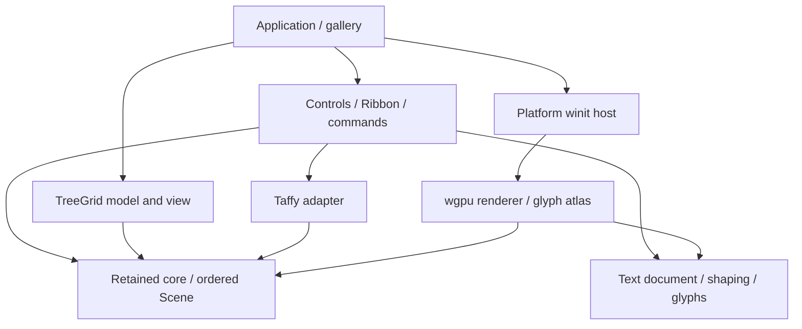

# Архитектура Rust UI Engine

Rust UI Engine — retained-mode библиотека для нативных desktop-приложений на
Windows, Linux X11/Wayland и macOS. Текущий исходный код alpha объединяет дерево,
layout, текст, компоненты, Ribbon, TreeGrid и платформенный host. Реализация
подсистем и подтверждение их работы на каждой ОС учитываются отдельно:
[матрица runtime](runtime-matrix.md), [состояние alpha](alpha-release-notes.md).

## Границы пакетов

| Пакет | Ответственность |
|---|---|
| `rust-desktop-ui-core` | WidgetId, UiTree, UiRuntime, routing, focus/capture, dirty flags, layout-типы и Scene; без внешних зависимостей |
| `rust-desktop-ui-layout` | Stack/Flex/Grid/Overlay через Taffy, без GPU/window API |
| `rust-desktop-ui-text` | Parley shaping, Swash rasterization, TextDocument, caret/selection geometry |
| `rust-desktop-ui-controls` | Label/Button/Toggle/CheckBox/TextBox, ScrollView/TabControl, меню, темы, команды и Ribbon |
| `rust-desktop-ui-treegrid` | Источник данных, разреженный индекс, view state и viewport rendering; зависит только от core |
| `rust-desktop-ui-render-wgpu` | GPU rectangle/glyph pipelines, atlas, surface/device lifecycle |
| `rust-desktop-ui-platform-winit` | Native event loop, ввод, IME, clipboard и AccessKit adapter |
| `controls-gallery` | Книжный источник, фоновые операции, связывание компонентов и платформенной семантики |
| `gpu-shell` | Ранние retained/rectangle диагностические сценарии |

Бизнес-логика и хранение данных принадлежат приложению. Core, text, controls и
TreeGrid не принимают wgpu/winit types. Платформенный host реализован отдельно;
renderer сохраняет адаптер surface к winit, как описано в [ADR-002](adr/ADR-002-scene-wgpu.md).
Новые границы уточняет [ADR-004](adr/ADR-004-text-controls-platform-treegrid.md).

## Retained tree и layout

Непрозрачный WidgetId включает идентичность arena, slot и generation. Reparent
сохраняет ID; удалённый или чужой ID отвергается. Callback mutations выполняются
после capture/target/bubble route. Default actions назначают mouse focus и
обрабатывают Tab/Shift+Tab. Capture и focus очищаются при удалении, blur и
недоступности поддерева. Подробности — [retained API](retained-ui.md).

Layout возвращает parent-local border boxes в дробных логических пикселях.
Поддерживаются Auto/Px/Percent, min/max, padding/margin/gap, align/justify,
Stack/Flex/Overlay и Grid с Auto/Px/Percent/Fr tracks и spans. Корень всегда
равен viewport. Глубина Taffy adapter ограничена 128 рёбрами; grid placement
и рост implicit tracks проверяются до вызова backend. См. [layout](layout.md).

При geometry invalidation пересчитывается всё layout tree. Paint-only изменения,
hover, focus, translation и scroll не вызывают layout. На idle `UiRuntime`
возвращает нулевые delta-счётчики и сохраняет Scene. Это свойство runtime,
а не обещание отсутствия работы любого приложения на timer events. Controls
могут обновлять caret и композицию; приложение решает, когда нужен следующий tick.

Intrinsic text measurement автоматически не подключён к Leaf: размеры текста
измеряются отдельно и должны быть переданы в layout. Incremental subtree layout,
flex-wrap, baseline alignment и произвольные intrinsic callbacks не реализованы.

## Scene и GPU

Scene хранит отдельные массивы `SolidRect` и `TextRun` с единым списком
`DrawCommand`. `fill`, `text` и `append` сохраняют последовательность рисования.
Смешение прямоугольников и текста не перегруппировывается поверх пользовательского
порядка: это важно для выделения, текста, caret и перекрывающих popup.

Runtime вычисляет translation, scroll и ancestor clips. Прямоугольники обрезаются
геометрически. Controls формируют текстовые runs с собственными clip bounds.
Renderer переводит логические координаты в физические, запрашивает подготовленные
глифы и рисует instanced quads с RGBA atlas. Swash выполняет CPU rasterization
глифов; конечная композиция UI выполняется GPU, скрытого software renderer нет.

Outline-маски используют белый RGB и coverage alpha с text tint; цветные глифы
сохраняют свой цвет. Atlas имеет размер 2048×2048 и padding между glyph slots.
При заполнении atlas очищается до построения UV текущего кадра; набор видимых
глифов, который не помещается после повторной загрузки, возвращает явную ошибку.
Текущие лимиты кадра — 16 384 rectangles, 16 384 text runs, суммарно 1 MiB
входного UTF-8 и 65 536 glyph instances. Удерживаемые bitmap allocations
кадра ограничены 64 MiB с учётом общих Arc. Paths,
произвольные изображения, сложные clip masks, rotations и opacity layers не входят
в этот renderer.

`GpuRenderer::render` возвращает `Presented`, `Skipped` или `RecoveryRequired`.
Host учитывает нулевой размер, occlusion, resize, DPI, timeout и ограниченное
число попыток восстановления. Модель приложения переживает пересоздание GPU.
Наличие этих веток не подтверждает проверку настоящего device loss.

## Текст и компоненты

Parley выбирает системные шрифты, выполняет shaping, fallback, bidi и wrapping.
Swash возвращает реальные glyph bitmaps. Layout cache не включает position,
color и clip, поэтому обычная прокрутка не требует повторного shaping. Шрифты
не поставляются вместе с исходниками. Наличие системного шрифта и поддержка
его цветного формата проверяются отдельно; `missing_glyphs` сообщает `.notdef`.

TextDocument хранит UTF-8, grapheme-safe selection/editing, undo/redo и временный
IME preedit. Для визуального bidi cursor используется index вместе с affinity;
байтового индекса недостаточно на границах направления и soft wrap. Общий
TextBox используется и как editor ячейки TreeGrid. См. [text](text.md).

Controls дополняют retained primitives состоянием и поведением: activation,
checked/disabled, текст, tabs, popup, scroll и semantic payload. Темы Light,
Dark и Compact задают собственные tokens. CommandRegistry отделяет команды
от widget identity; проверка enabled/can_execute действует на общий путь
исполнения. Ribbon составляется из tabs/groups/items, quick access и context
tabs, адаптивно сворачивает группы и открывает доступ к командам через KeyTips.
Контракты и текущие ограничения — [controls](controls.md) и [Ribbon](ribbon.md).

## Native host и accessibility

Минимальный пример и полный контракт host — в [platform](platform.md).

`DesktopApp` предоставляет update, Scene, обработку PlatformEvent, title,
IME caret, optional wake timer и полное AccessKit tree. Host нормализует pointer
и wheel в логические пиксели; logical keys, committed text и IME preedit/commit
передаются раздельно. Clipboard requests выполняются через arboard. Ошибка
clipboard диагностируется без подмены данных фиктивным успешным результатом.

IME cursor area передаётся окну в логических координатах. Accessibility bounds
передаются в физических client pixels. Host создаёт AccessKit adapter до показа
окна, отправляет изменённые nodes и маршрутизирует accessibility actions в app.
Controls/TreeGrid содержат независимую семантику; gallery связывает widget IDs
и stable RowKeys с отдельными accessibility IDs и обрабатывает действия.

Подготовленный semantic tree не доказывает корректную работу NVDA, Narrator,
VoiceOver или Orca. Точно так же preedit unit tests не заменяют native IME
проверку candidate window, commit/cancel и DPI. Эти проверки остаются явными
пунктами [runtime matrix](runtime-matrix.md).

## TreeGrid и источник данных

TreeDataSource предоставляет индексированный доступ к stable RowKey и ColumnId.
Разреженные интервалы между раскрытыми ветками позволяют представлять большие
плоские наборы и иерархии без UI node на каждую запись. View обходит строки
viewport с overscan и видимые колонки; horizontal lookup использует prefix widths.
Сортировка и фильтрация делегируются источнику и не требуют копирования всей БД
в UI. Изменение структуры обновляет индекс отдельно от обычного scroll.

Lazy children используют request tokens с идентичностью модели/epoch: поздние,
отменённые и чужие ответы отвергаются. Host отвечает за worker lifecycle и
доставку результата. Selection сохраняет stable keys. Cell edit хранит draft,
validation error и commit/cancel; источник должен атомарно применять изменения.
Versioned column state включает порядок, ширину и pinning. Файл и сохранение
выбирает приложение. См. [TreeGrid](treegrid.md).

Alpha использует фиксированную высоту строк. Variable heights, grouping/summary,
Docking и PropertyGrid относятся к последующему объёму работ. CPU benchmark
построения Scene не измеряет GPU FPS или latency native input.

## Сборка и проверка

Rust 1.96.0, edition 2024, resolver 3 и Cargo.lock закрепляют окружение.
Taffy включает Flex и Grid; Parley использует system/complex-scripts. Wgpu
включает D3D12/Vulkan/Metal, winit — X11/Wayland. CPU/Noop adapters отвергаются.
На Linux для Fontconfig нужен development package и системные fonts. Adwaita
декорации не включены; Wayland compositor без server-side decorations может
показать окно без рамки. Features/FFI/лицензии описаны в [dependencies](dependencies.md).

Unit tests, compilation, CI, CPU benchmark, GPU smoke и ручные проверки — разные
виды свидетельств. Результаты M0/M1 сохраняются как исторические отчёты и не
переносятся автоматически на новый gallery. Источники остаются Apache-2.0;
упаковка binary требует отдельного выполнения условий сторонних лицензий.
